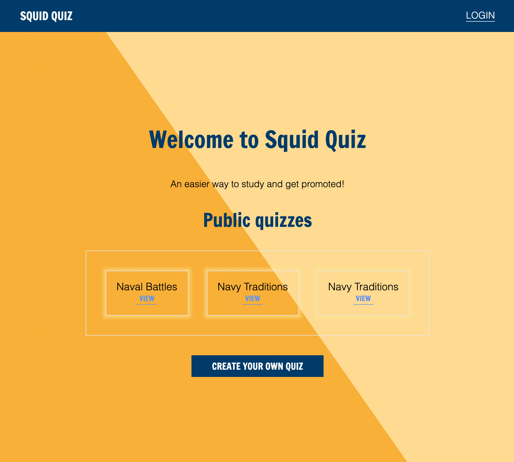
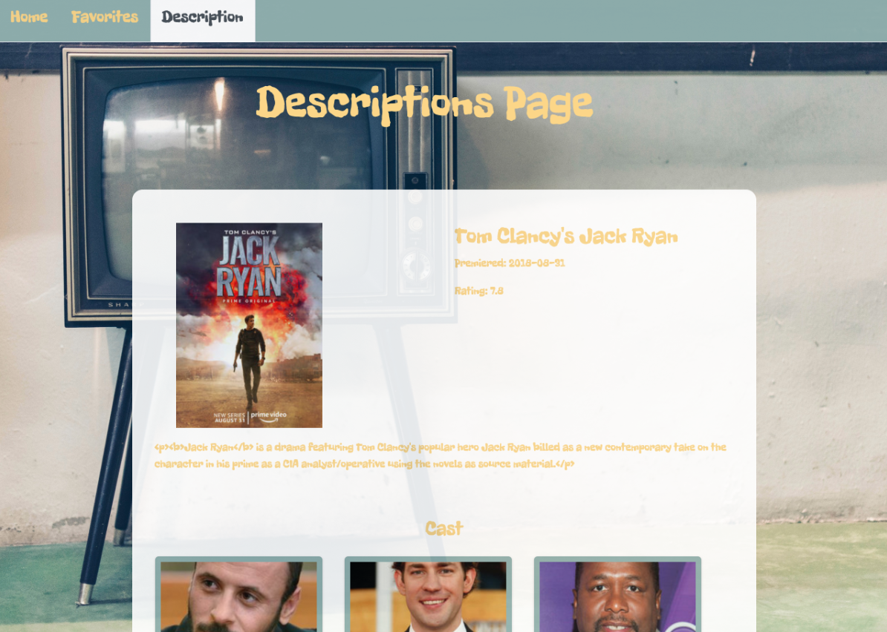

<!-- Main -->

<!-- One -->
<section id="one">
	

	

</section>

<!-- Two -->
<section id="two" class="spotlights">
	<section>
		
		

			

				<header class="major">
					<h3>Squid Quiz</h3>
				</header>
				
In my last advanced database class, I built a quiz app designed for US Navy sailors to be able to make their own quizzes to practice for advancement exams or boards. The project was built using first vanilla JS, building a web and API server, then converting that into a React app with Node.js and Redux.

				<ul class="actions">
					<li><a href="https://github.com/ASL-WDD442/asl-quiz-app-pmritchie" class="button">Learn more</a></li>
				</ul>
			

		

	</section>
	<section>
		
		

			

				<header class="major">
					<h3>TV-Buff</h3>
				</header>
				
This app was built with React.js and pulls from TV Maze API to search for TV shows and actors. A user can search for shows and actors via search bar. A description page is loaded when the user clicks on an actor/show card and a user can also add their favorites view them later. This application is currently being converted to a MERN stack application for back end compatibility.

				<ul class="actions">
					<li><a href="https://github.com/pmritchie/TV-BUFF-WEBAPP" class="button">Learn more</a></li>
				</ul>
			

		

	</section>
	<section>
		
		

			

				<header class="major">
					<h3>PHP Framework</h3>
				</header>
				
For this project I used PHP to build a grocery cart application where the user can input what they want on a grocery list along with using Bootstrap to create the layout of the app. I used VirtualBox with Vagrant and Ubuntu to create the server and MySQL for the database. This project was also recreated using CodeIgniter framework for some experience in PHP frameworks. 

				<ul class="actions">
					<li><a href="https://github.com/pmritchie/CodeIgniter-Fruit-App" class="button">Learn more</a></li>
				</ul>
			

		

	</section>
</section>

